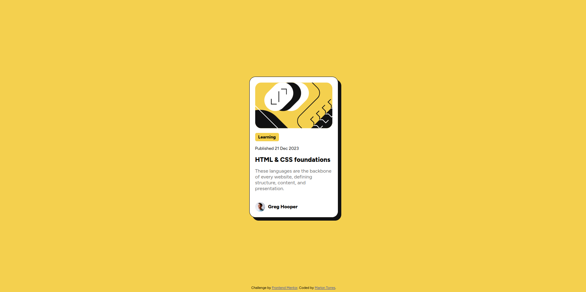

# Frontend Mentor - Blog preview card solution

This is a solution to the [Blog preview card challenge on Frontend Mentor](https://www.frontendmentor.io/challenges/blog-preview-card-ckPaj01IcS). Frontend Mentor challenges help you improve your coding skills by building realistic projects.

## Table of contents

- [Overview](#overview)
  - [The challenge](#the-challenge)
  - [Screenshot](#screenshot)
  - [Links](#links)
- [My process](#my-process)
  - [Built with](#built-with)
  - [What I learned](#what-i-learned)
- [Author](#author)

## Overview

### The challenge

Users should be able to:

- See hover and focus states for all interactive elements on the page

### Screenshot



### Links

- Solution URL: [blog-preview-card](https://github.com/marloneth/blog-preview-card)
- Live Site URL: [Frontend Mentor - Blog preview card](https://marloneth.github.io/blog-preview-card/)

## My process

### Built with

- Semantic HTML5 markup
- CSS custom properties
- Flexbox
- Mobile-first workflow

### What I learned

I learned how to use the `clamp()` CSS function to set max and min bounds in font sizes.

```css
.text {
  font-size: clamp(<min>, <preferred>, <max>);
}
```

## Author

- Website - [Marlon Torres](https://github.com/marloneth)
- Frontend Mentor - [@marloneth](https://www.frontendmentor.io/profile/marloneth)
